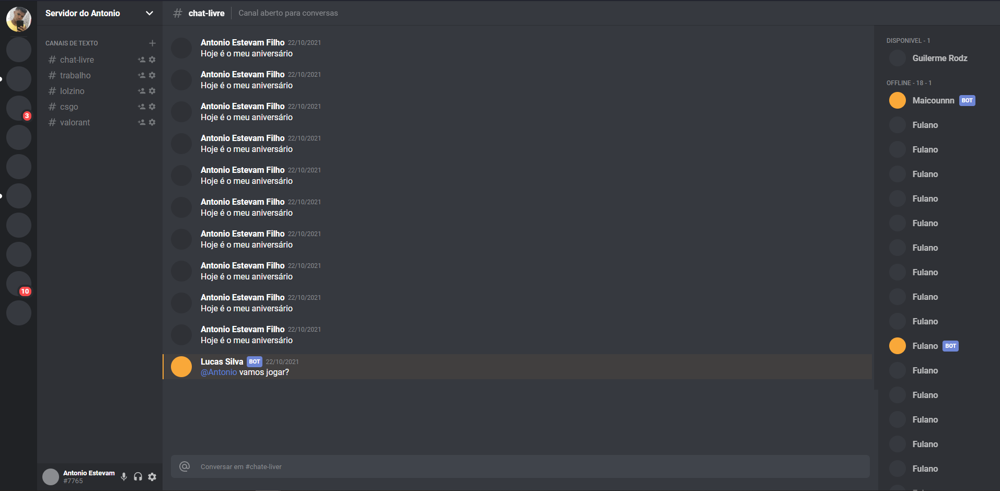

<h1 align="center">
 
 
DISCORD CLONE
</h1>

Clone of the discord web visual interface

  

 

## Features
[//]: # (Add the features of your project here:)
This app features all the latest tools and practices in mobile development!

- ⚛️ **React Js** — A JavaScript library for building user interfaces

 
## Downloading the project

  $ git clone git://github.com/Antonio-Estevam/clone-disacord

## Install dependencies

run the following command on the terminal inside the project folder to install dependencies
  $ npm install

## start project
  $ yarn start

## License

This project is licensed under the MIT License - see the [LICENSE](https://opensource.org/licenses/MIT) page for details.
